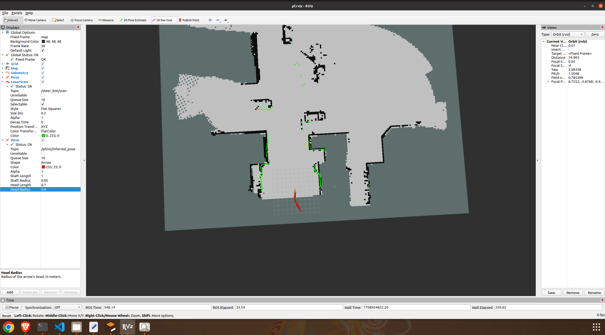
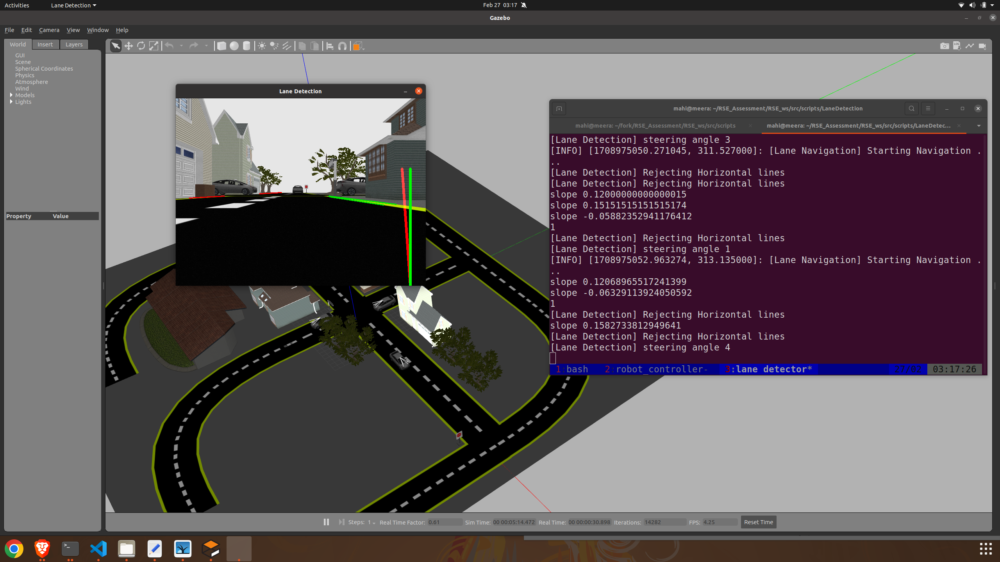

# Micropolis Robotics - Robotics Software Engineer Technical Assessment

## Overview

This repository encompasses scripts and tools developed for a robot navigation system, emphasizing Simultaneous Localization and Mapping (SLAM). The navigation process is categorized into the following steps:

1. **Mapping**
2. **Offline Localization**
3. **Navigation with Obstacle Avoidance**
4. **GUI Development**
5. **Odometry Source**

## Scripts

The provided bash scripts orchestrate standalone operations, incorporating `tmux` for the proper shutdown of nodes at each operational stage.

# **1. Mapping**

Mapping is a crucial component of the navigation algorithm in Simultaneous Localization and Mapping (SLAM). For this task, I have incorporated data from different sensors to create a comprehensive map. The sources utilized include:
1. Camera
2. 3D LIDAR
3. Odometry 

Initiate mapping using the following command:

```bash
bash ~/RSE_Assessment/RSE_ws/src/scripts/standalone_navigation/mapping_scripts.bash
```
These diverse sensor inputs are combined using `rtabmap`. The integration of these topics and sensor data is streamlined in the launch script provided under the `rtabmap_ros` directory.


## 1.1 Generate Map:

The resulting map, generated from the city.world environment, is stored under `steer_bot_navigation/maps`. This map serves as the basis for all navigation testing processes, ensuring consistency.


# **2. Offline Localization:**

Offline Localization has been divided into two sections, focusing on localization using Particle Filter and ICP/NDT methods.

## 2.1. Particle Filter:
In this method, a required map and scan (Laserscan) are used. The point clouds are converted to laserscan and passed as input to the Particle Filter along with odometry data. The initial confidence of the system-based localization can be set using RViz 2D Pose estimate or a UI. The live matching or localization can be visualized in `RViz`, where `/scan_percentage` is used to estimate the confidence level. To launch the Particle Filter-based localization, use the following command:
```
bash ~/RSE_Assessment/RSE_ws/src/scripts/MCL_offline/MCL_localization.bash
```


## 2.2 ICP and NDT-based Localization:
This method utilizes the topic of the map and Laserscan to estimate the matching correspondence of the scan to the map. The process involves the conversion of the occupancy grid to the map_cloud and the laserscan topic to perform a match between the two systems. The configuration for this process can be set via `steer_bot_navigation/launch/LaserICP/icp.yaml`. Accepted configurations include `'icp'` and `'ndt'` for correspondence matching. The resulting offline localization score is published via `/localization_score`. To launch ICP and NDT-based localization, use the following command:

```
bash ~/RSE_Assessment/RSE_ws/src/scripts/offline_localization/offline_localization.bash
```

### Challenges:
1. Limited Map Features:
   The map has a scarcity of features, leading to higher uncertainty and causing frequent drifts in localization.

2. Reliability in Smaller Environments:
   The provided localization solution appears reliable in smaller environments with solid features. However, for extensive navigation, significant drift issues are observed.
   
### Drawbacks - Particle Filter:
1. While Particle Filter aligns well with the initial environment, it exhibits substantial drift after covering a considerable distance. This characteristic makes it less suitable for scenarios requiring extensive navigation.
   
2. ICP and NDT:
NDT-omp (Normal Distributions Transform - OpenMP) demonstrates better performance than ICP. However, it lacks significant convergence for a smoother and more accessible system.
These drawbacks highlight the challenges in achieving robust and precise localization, especially in scenarios with limited map features and extensive navigation requirements. Further improvements or alternative methods may be necessary to enhance localization reliability.

# **3. Navigation with Obstacle Avoidance**

For the primary navigation task, AMCL and move-base were employed. However, various planners, such as SBPL and pose follower, were explored. Despite these efforts, navigation presented complexities, including frequent drift and continuous loss of position.

To launch the navigation process, use the following command:

```
bash ~/RSE_Assessment/RSE_ws/src/scripts/standalone_navigation/localization_nd_navigation.bash
```
This script initiates both localization and navigation, allowing the experience of obstacle avoidance in the navigation environment created earlier.


### 3.1. Drawbacks:
- Unreliable Navigation:
   Navigation proves unreliable due to a scarcity of features, leading to frequent disorientation, and the robot often loses its localization.


## 3.2. Solution - Lane Navigation:
To address the challenges mentioned above, the following solutions are proposed: 

Lane detection and navigation test image



-  **Enhance Map Features:**
   Improve navigation reliability by adding additional features to the map. However, challenges may arise in parts of the map with minimal features, making navigation challenging.

-  **Incorporate Machine Vision:**
   Utilize machine vision to enhance navigation effectiveness. A proof of concept solution involves the implementation of a lane detection module. Lanes are considered solid features that can enhance navigation for the given world sceario. However, frequent odometry drifts may occur, and this can be addressed through fusion techniques.

To launch the lane navigation module, use the following command:

```
bash ~/RSE_Assessment/RSE_ws/src/scripts/LaneDetection/lane_detection.bash
```
## 3.3 Lane Navigation System Enhancement

- The following represents a proof-of-concept approach aimed at significantly enhancing the reliability and coverage of navigation across larger areas, surpassing the capabilities of previous navigation techniques. However, specific aspects, such as the lane detection method, require further refinements for optimal performance.

1. Lane Detection Improvements:
    1. Local Costmap Generation:
    2. Adaptive control
    3. Incorporate robout detection datasets specifically covers T junction lanes and further sign detection module


# **4. Web Development for Navigation functionality**

The web GUI is a standalone interface accessible through 127.0.0.1:5000.

To launch the web GUI, use the following command:
```
bash ~/RSE_Assessment/RSE_ws/src/scripts/web_gui/startup_scripts.bash
```

Once initiated, the web interface offers various options, empowering users to:

### **4.1 Perform Mapping:** 
- *Start and Stop Mapping:*
  - Utilize features for mapping purposes.
- *Save Map:*
  - Save the generated map for future use.
- *Delete Map:*
  - Remove unwanted maps from the system.

### **4.2 Set Goals:**
- Initialization:
  - Initialize the robotic system for goal setting.
- Set Goals:
  - Define specific destinations for the robotic system.
- Remote Joystick for Teleop:
  - Enable remote joystick control for teleoperation.
  
Explore the user-friendly functionalities provided by the GUI, streamlining the management and control of various aspects of the robotic navigation system.

# **5. Odometry Feedback**

The Odometry Feedback Controller can be launched using the following command:

```
bash ~/RSE_Assessment/RSE_ws/src/scripts/Odometry_publisher/odometry_publisher.bash
```

This controller utilizes the configuration of wheel base parameters and subscribes to the `/steer_bot/ackermann_steering_control/cmd_vel` topic to generate and publish odometry information. Depending on the calibration of the wheel base, these parameters can be updated to ensure accurate odometry readings. The resulting odometry data is published to the `/steer_bot/ackermann_steering_control/odom` topic, aligning with the structure defined in the Gazebo URDF


# **6. Dependencies:**

1. **RangeLibc** - Required for Particle Filter Installation
   - [RangeLibc GitHub Repository](https://github.com/kctess5/range_libc)
   ```
   git clone http://github.com/kctess5/range_libc
   cd range_libc/pywrappers
   python3 setup.py 
   ```


2.  **rtabmap_ros** -- Mapping and Localization
    - [RangeLibc GitHub Repository](https://github.com/introlab/rtabmap_ros)

3. **navigation-experimental** -- SBPL lattice planner and pose follower
    - [Navigation-Experimental ](https://github.com/ros-planning/navigation_experimental)
